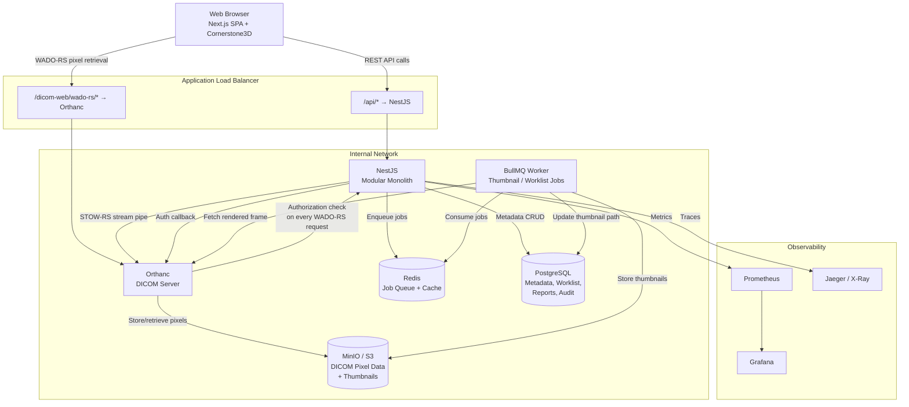
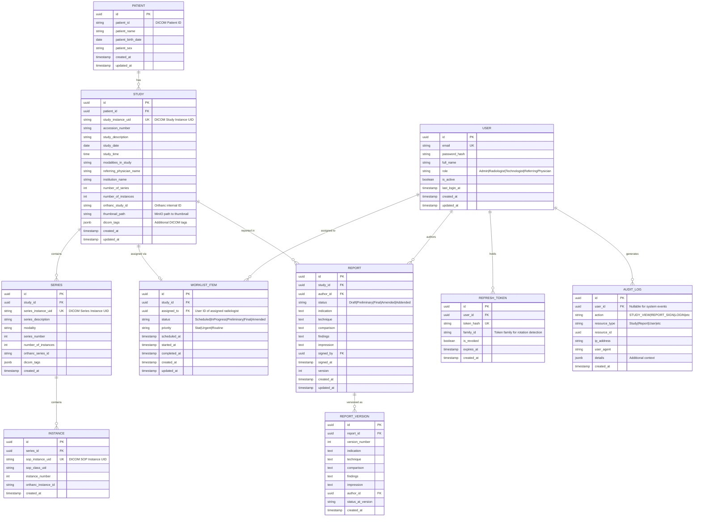
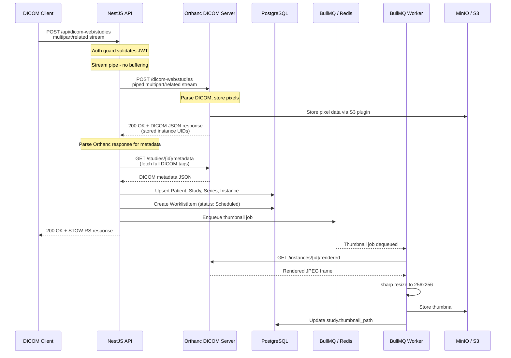
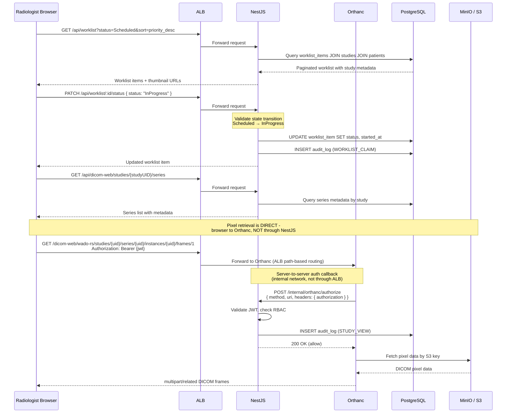
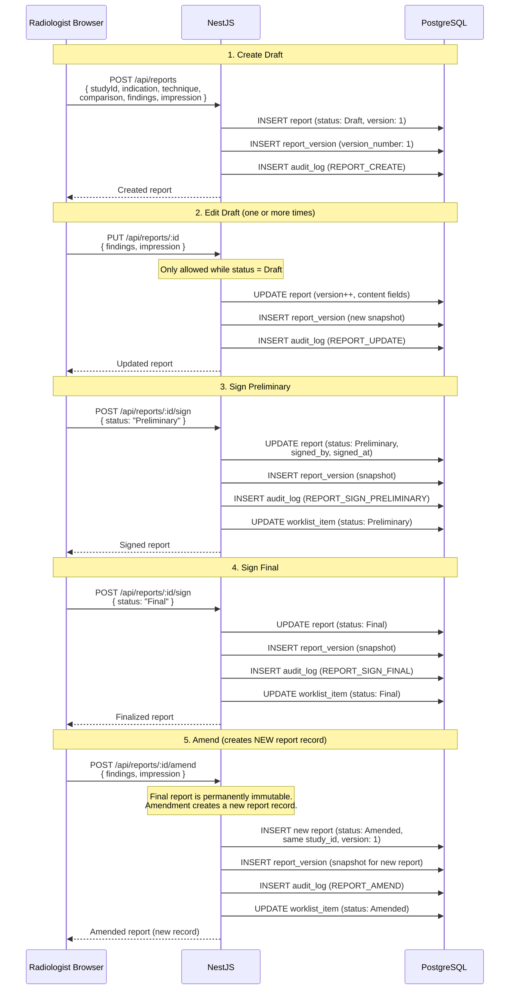
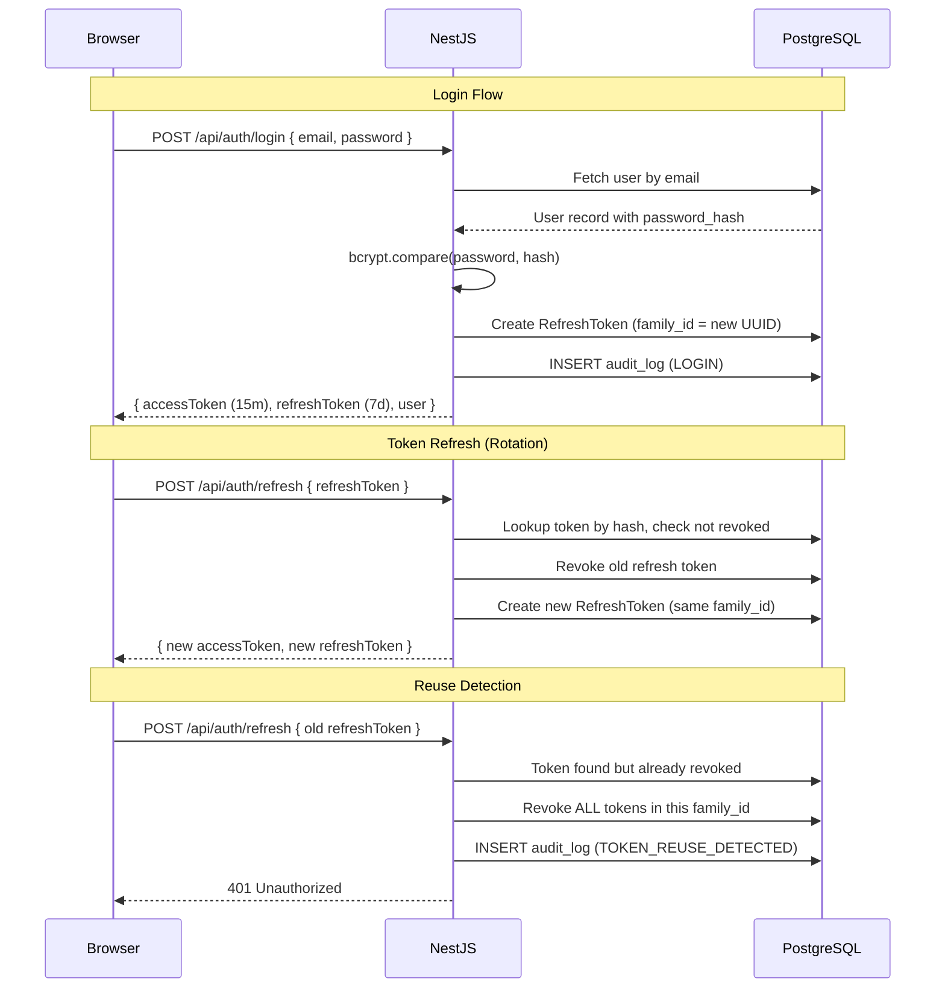
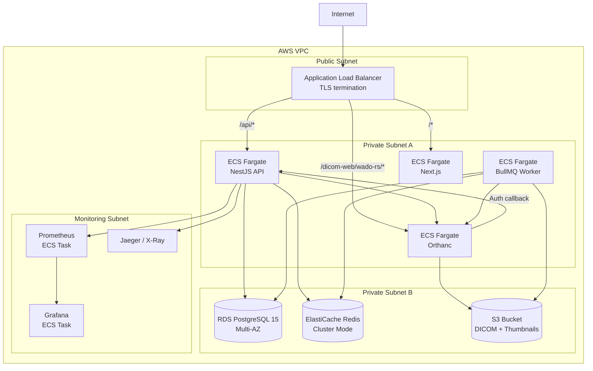
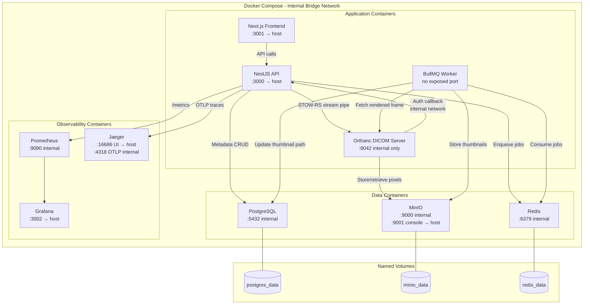

# RadVault - Architecture Document

**Author:** Noah
**Date:** 2026-03-01

---

## System Overview

### High-Level Architecture

### Description

**Modular monolith over microservices.** I'm running one NestJS process with five modules, built into a single container image. microservices got nixed for two reasons:

1. Operational overhead at this scale is unjustifiable. five services means five Dockerfiles, five CI pipelines, five ecs task defs for workflows that span DICOM ingest and worklist creation. for a few bounded contexts and a tiny team, that kills velocity.

2. Cross-cutting concerns are way easier in-process. auth guards, audit interceptors, transactions all live in Nest's DI. with microservices i'd either copy auth logic everywhere or add it behind an api gateway with shared middleware.

The modular monolith still lets me extract modules out later. each module has its own service layer, controller layer, and Prisma queries, and module internals don't import each other directly, only talk through exported service interfaces.

**Service boundaries inside the monolith:**

- **DicomModule:** stow-rs ingest (stream piping to orthanc), qido-rs queries, metadata persistence, thumbnail job dispatch
- **WorklistModule:** worklist state machine, assignment, status transitions with validation
- **ReportModule:** report CRUD, section management, signing workflow, pdf generation
- **AuthModule:** jwt issuance, refresh token rotation, password hashing, rbac guard
- **AuditModule:** append-only audit writes, admin-facing audit query endpoints

Communication patterns: modules talk in-process via injected services. externals are http to orthanc's DICOMweb and s3-compatible calls to minio. bullmq workers run in a separate node process so cpu-heavy thumbnail work doesn't intervene the api event loop.

Nestjs treats orthanc like infra, basically a database, not a peer service. it offloads all the messy dicom stuff to orthanc. nestjs itself doesn't care about the dicom wire format. it talks to orthanc over REST and to its own postgres schema. keeps the dicom protocol mess tucked behind one http client in dicommodule, so swapping orthanc for another dicomweb server only means changing that module.

---

## Data Model

### Entity-Relationship Diagram

### Design Decisions

**UUIDs as primary keys** instead of serial integers. Resource IDs are exposed in API paths (`/api/reports/:id`, `/api/worklist/:id`), and sequential integers invite enumeration attacks - an attacker can trivially iterate over `/api/reports/1`, `/api/reports/2`, etc. to probe for accessible resources. UUIDs eliminate that attack surface. They're also safe to generate client-side if needed (e.g., for optimistic inserts) and carry no coupling to insertion order, which matters if data is ever migrated or merged across environments.

**DICOM UID mapping:** `study_instance_uid`, `series_instance_uid`, and `sop_instance_uid` are stored as plain strings - not parsed, not validated beyond non-empty. These are the DICOM-standard globally unique identifiers that the DICOMweb protocol uses for addressing. Alongside them, Orthanc's internal IDs (`orthanc_study_id`, `orthanc_series_id`, `orthanc_instance_id`) are stored as separate columns. The two ID spaces are kept separate deliberately: DICOM UIDs are used in API paths and client-facing queries (QIDO-RS, WADO-RS), while Orthanc IDs are used exclusively for internal REST calls to Orthanc's API (e.g., fetching metadata, retrieving rendered frames). This separation means the application never conflates the two, and replacing Orthanc would only require updating the Orthanc ID columns and the DicomModule HTTP client.

**JSONB `dicom_tags` column** on STUDY and SERIES stores the full DICOM tag set beyond the explicitly indexed columns. This enables flexible queries (e.g., filtering by InstitutionName or BodyPartExamined) without schema migrations for every new tag. The JSONB column is not indexed by default - only when a tag becomes a common query filter would it be promoted to a dedicated indexed column. This keeps write performance high during ingest while preserving query flexibility.

**Indexing strategy:** These are the columns that appear in WHERE clauses and JOIN conditions for QIDO-RS queries, worklist queries, and audit log queries:

- `study`: `study_date`, `modality`, `referring_physician_name`, `accession_number` (QIDO-RS filter columns)
- `study`: `patient_id` FK (patient → study traversal joins)
- `worklist_item`: `status`, `assigned_to` (worklist query filters)
- `audit_log`: composite index on `(user_id, created_at)` (audit query filters - supports both user-scoped and time-range queries efficiently)
- `patient`: `patient_id` (deduplication lookup on ingest)
- `series`: `study_id` FK, `modality` (series-level QIDO-RS filters)

All other columns are unindexed unless query profiling shows otherwise.

**REPORT_VERSION alongside REPORT.version:** The `version` field on REPORT tracks the current version number and serves as an optimistic concurrency control token - clients send the version they last read, and the update is rejected if it has since changed. REPORT_VERSION stores immutable snapshots of the full report content at each version, so the complete edit history can be reconstructed independently of the live REPORT record. This dual approach means the live record stays lean for reads while the version table provides a complete audit trail. The two are complementary, not redundant: REPORT.version is for concurrency control, REPORT_VERSION is for historical reconstruction.

---

## Request Flow Diagrams

### DICOM Ingestion Flow

**Stream piping is the critical design choice here.** When a STOW-RS request arrives at NestJS, the incoming `multipart/related` request body is piped directly to Orthanc's STOW-RS endpoint as a Node.js readable stream. NestJS never buffers the full multipart body in memory. This is essential because a single CT study can contain 500+ slices at 512x512 resolution, easily exceeding 500MB. If NestJS buffered the entire payload before forwarding to Orthanc, a handful of concurrent uploads would exhaust the container's memory allocation and crash the process. Stream piping keeps NestJS memory usage constant regardless of study size - it processes data in chunks as it flows through.

**NestJS is a traffic director, not a relay.** Its responsibilities during ingest are: (1) authenticate the request, (2) pipe the stream to Orthanc, (3) wait for Orthanc's confirmation, (4) extract metadata from the confirmation response, (5) write metadata to PostgreSQL, (6) enqueue async jobs. At no point does NestJS own, parse, or hold pixel data. The sequencing is deliberate - metadata writes and job enqueues happen only after Orthanc confirms successful storage, so a failed Orthanc write does not leave orphaned metadata rows in PostgreSQL.

**Metadata extraction happens from Orthanc's response and a follow-up metadata query, not from parsing the incoming DICOM stream.** This avoids duplicating DICOM parsing logic and ensures the metadata in PostgreSQL matches exactly what Orthanc stored.

### Study Viewing Flow

The browser never touches the audit path. Audit enforcement is a server-to-server control between Orthanc and NestJS via the authorization plugin callback. This is why direct browser → Orthanc pixel access does not bypass HIPAA audit requirements - every WADO-RS request triggers the callback, and NestJS writes the audit log entry before returning the allow decision. If JWT validation fails or RBAC denies access, Orthanc returns 403 to the browser without serving any pixel data.

### Reporting Flow

Every state transition writes both a REPORT_VERSION snapshot and an AUDIT_LOG entry. The full edit history of any report can be reconstructed from audit_log alone, independent of the REPORT_VERSION table. The Final report is permanently immutable after signing - amendment creates a new report record linked to the same study, it does not mutate the Final report.

---

## Security Architecture

### Authentication Flow

### Authorization Matrix

| Action                    | Admin | Radiologist        | Technologist | Referring Physician    |
| ------------------------- | ----- | ------------------ | ------------ | ---------------------- |
| Upload studies (STOW-RS)  | ✅    | ❌                 | ✅           | ❌                     |
| Search studies (QIDO-RS)  | ✅    | ✅                 | ✅           | ✅ (own patients only) |
| View images (WADO-RS)     | ✅    | ✅                 | ✅           | ✅ (own patients only) |
| View study metadata       | ✅    | ✅                 | ✅           | ✅ (own patients only) |
| Create report (draft)     | ❌    | ✅                 | ❌           | ❌                     |
| Edit report (draft)       | ❌    | ✅ (author only)   | ❌           | ❌                     |
| Sign report (preliminary) | ❌    | ✅                 | ❌           | ❌                     |
| Sign report (final)       | ❌    | ✅                 | ❌           | ❌                     |
| Amend signed report       | ❌    | ✅                 | ❌           | ❌                     |
| View reports              | ✅    | ✅                 | ❌           | ✅ (own patients only) |
| Manage worklist (assign)  | ✅    | ❌                 | ❌           | ❌                     |
| Update worklist status    | ✅    | ✅ (assigned only) | ❌           | ❌                     |
| Manage users              | ✅    | ❌                 | ❌           | ❌                     |
| View audit logs           | ✅    | ❌                 | ❌           | ❌                     |
| System configuration      | ✅    | ❌                 | ❌           | ❌                     |

**Referring Physicians** are scoped to studies where they are listed as the referring physician in the DICOM metadata (`ReferringPhysicianName` tag). This is enforced at the query level - the service layer adds a WHERE clause filtering by the referring physician's name. This is a simplification; a production system would need a more robust patient-physician relationship model.

**Technologists** can upload and search but cannot create reports or view existing reports. They interact with the PACS for ingestion and quality control, not for diagnostic interpretation.

---

## Infrastructure

### Cloud Deployment Architecture

### Container Architecture

**Exposed ports to host:** NestJS API (:3000), Next.js frontend (:3001), MinIO console (:9001), Grafana (:3002), Jaeger UI (:16686). All other ports are internal to the Docker bridge network only. Orthanc is deliberately not exposed to the host - all WADO-RS access in local dev goes through NestJS or a local reverse proxy that replicates the ALB path-based routing.

**Named volumes** (`postgres_data`, `minio_data`, `redis_data`) ensure stateful service data persists across container restarts. Orthanc does not need a named volume because pixel data is stored in MinIO via the S3 plugin.

**The Orthanc → NestJS auth callback** runs entirely on the internal bridge network. Orthanc calls `http://nestjs:3000/internal/orthanc/authorize` - this hostname resolves only within the Docker Compose network and is not reachable from the host.

---

## Appendix

### Technology Comparison Notes

**OHIF vs Cornerstone3D:** OHIF is a full viewer application with its own routing, state management, and UI. Embedding it inside a Next.js app means fighting two application shells. Cornerstone3D gives the rendering pipeline without the application layer, so the UI, state, and routing stay entirely within Next.js. Rejected OHIF to avoid the integration friction.

**Microservices vs modular monolith:** Microservices would mean five Dockerfiles, five CI pipelines, five ECS task definitions, and distributed transaction coordination for cross-module workflows. For a small number of bounded contexts and a single team, the operational overhead kills velocity without delivering scaling benefits. Rejected microservices in favor of a modular monolith with clean module boundaries.

**GCP Cloud Run vs AWS ECS Fargate:** Cloud Run's per-request billing and scale-to-zero is attractive, but Orthanc is a long-running server with in-memory indexes that suffers 5-15 second cold starts. The Orthanc-to-NestJS auth callback also needs sub-millisecond private network latency, which VPC connectors on Cloud Run add friction to. Rejected Cloud Run because the persistent-process model of ECS Fargate is a better fit for Orthanc.

**MongoDB vs PostgreSQL:** DICOM metadata is semi-structured, so document storage seems natural, but the worklist state machine needs transactional guarantees on state transitions and the reporting module needs relational joins across users, studies, and reports. Rejected MongoDB because forcing those relational patterns into its transaction model is operationally painful.

**argon2 vs bcrypt:** argon2id is the OWASP recommendation for its GPU-resistance via memory-hardness, but the `argon2` npm package requires native builds that sometimes fail on Alpine Linux Docker images with older glibc. bcrypt at cost factor 12 is adequate for an application with rate-limited login endpoints and account lockout. Rejected argon2 to avoid deployment friction for a marginal security gain in this context.

**Proxying WADO-RS through NestJS vs direct browser → Orthanc:** Proxying pixel data through NestJS would make the API server a throughput bottleneck for large imaging payloads (CT series can be hundreds of megabytes). Direct browser-to-Orthanc access, with authorization enforced via Orthanc's callback plugin to NestJS, keeps pixel transfer off the API server while preserving audit and access control. Rejected the proxy approach to avoid the throughput bottleneck.

### Resolved Questions

- **Orthanc authorization plugin configuration:** the orthanc-authorization plugin sends a JSON POST to `tokens/validate` with fields `token-key`, `token-value` (the raw `Bearer <jwt>` string), `dicom-uid`, `orthanc-id`, `level`, `method`, and `server-id`. NestJS strips the Bearer prefix, verifies the JWT with RS256, enforces role-based access (Technologists are denied GET on study/series/instance levels), and writes an audit log entry before returning `{ granted: true, validity: 0 }`. a second callback at `user/get-profile` returns label/permission arrays derived from the JWT role claim for Orthanc's internal authorization layer.

- **Cornerstone3D WADO-RS URL configuration:** Cornerstone3D's `wadorsImageLoader` accepts an arbitrary WADO-RS root URL when constructing `imageId` strings in the format `wadors:<wadoRoot>/studies/{uid}/series/{uid}/instances/{uid}/frames/1`. the root is set via the `NEXT_PUBLIC_ORTHANC_WADO_URL` environment variable (defaults to `http://localhost:8042/dicom-web`). no custom loader registration or URL rewrite was needed — the standard `wadors:` scheme prefix handles it natively.

- **Refresh token storage on the client:** tokens are stored in `sessionStorage` via Zustand's `persist` middleware with `createJSONStorage(() => sessionStorage)`. sessionStorage was chosen over localStorage because it scopes tokens to the browser tab and clears on tab close, reducing the window for token theft. httpOnly cookies were rejected to avoid CSRF complexity and to keep the auth flow stateless from the server's perspective — the API never sets cookies, only returns JSON tokens.
