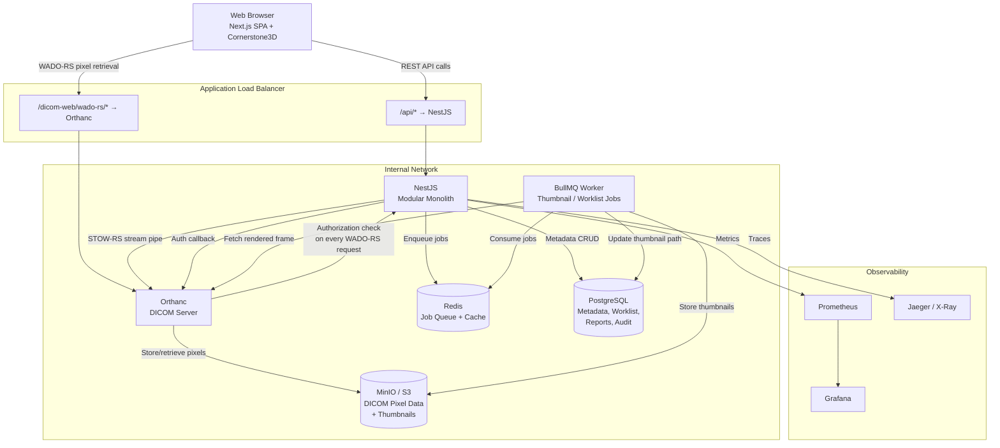
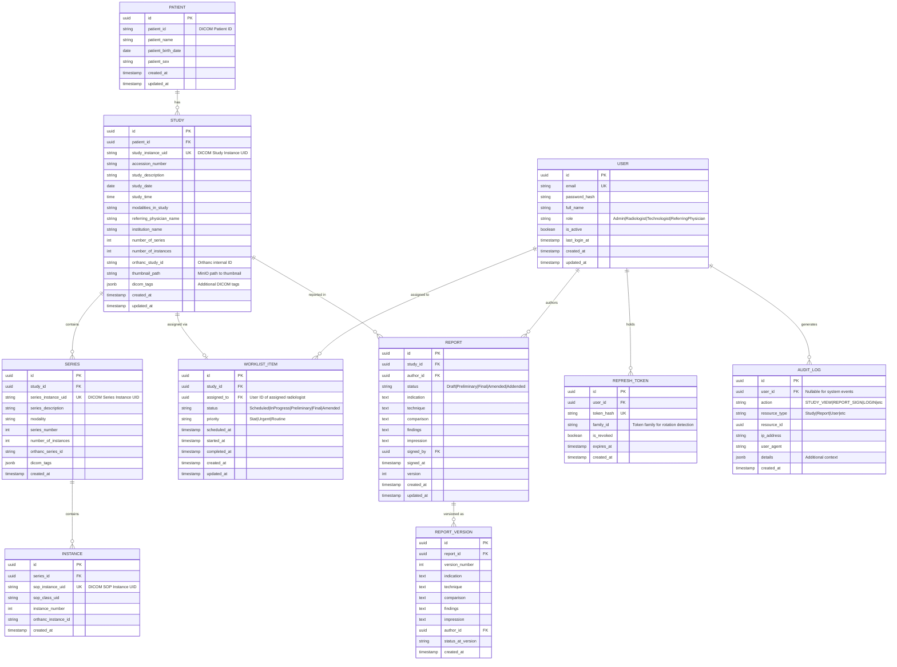
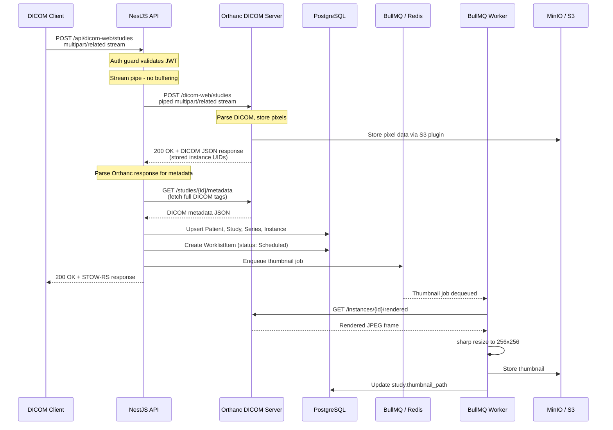
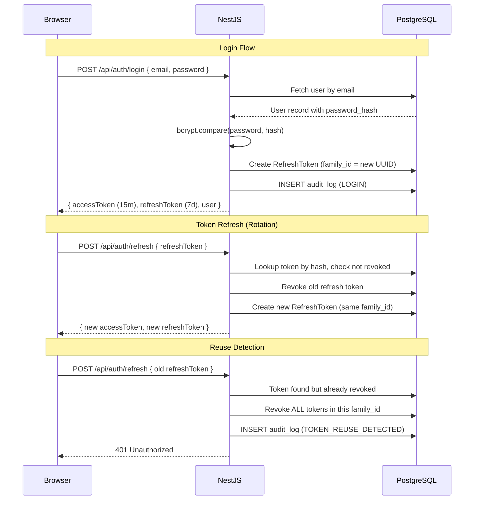
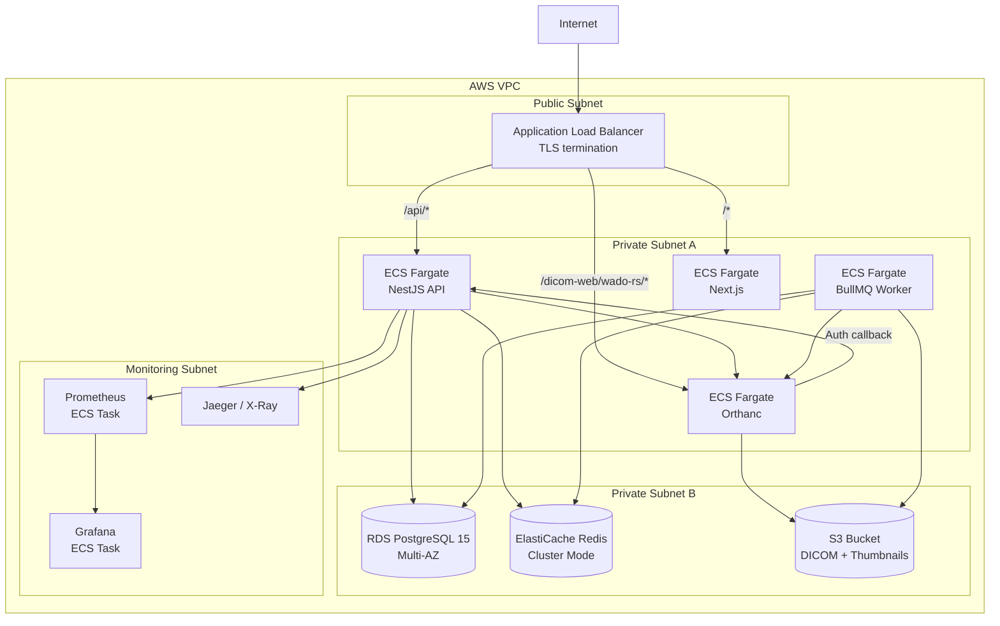

# RadVault - Requirements & Design Document

**Author:** Noah
**Date:** 2026-03-01
**Version:** 1.0

---

## 1. Technology Stack Selection

### Language(s) & Runtime

**TypeScript** across the entire stack - backend, frontend, and tooling.

I picked a single-language stack on purpose. when you’ve got limited time, flipping between languages eats more cycles than any theoretical speed boost from tossing the backend into go or rust. typescript buys me compile-time safety on both ends, shared types for DICOM metadata, and one tsconfig to rule them all.

### Backend Framework

**NestJS** configured as a modular monolith, with **Prisma ORM** for database access and **@nestjs/swagger** for OpenAPI spec generation.

Express first but it’s too low-level for the module boundaries i actually need, then fastify solo, fast but zero built-in DI or module system. nestjs won because its module system lines up with the bounded contexts i care about. the di container matters to inject audit logging, auth guards, and transaction handling everywhere without hand-wiring. prisma for the db since the generated client gives type-safe queries tied to the schema and migrations are deterministic. and @nestjs/swagger decorates controllers to bring out an openapi spec automatically, which is perfect for the api contract deliverable so i don’t have to write a separate spec file.

### Frontend Framework

**Next.js 14 (App Router)** with **Tailwind CSS** and **shadcn/ui** for the component library. **TanStack Query** for server state management. **Zustand** for client-side state.

Next.js gives me file-based routing, server components (seo doesn’t matter there but ssr shaves time-to-first-paint), plus api route handlers. next’s image optimization, middleware for auth redirects, and straightforward ecs deployments won. tailwind, always, since it makes smaller bundles & avoids runtime style injection. shadcn/ui, because it hands me copy-paste components and i don’t have to remake the wheel.

Tanstack query owns server state with study lists, worklist items, report data. it brings cache invalidation, background refetching, optimistic updates. zustand holds the client-only bits like viewer tool selection, active viewport layout, window/level presets. picked zustand over redux because the client state surface is tiny.

### Database(s)

**PostgreSQL** for all relational data (DICOM metadata, worklist, reports, users, audit logs). **Redis** as the backing store for BullMQ job queues and optional caching.

Postgresql’s the only real option for this workload. i need jsonb columns, full-text search for report content, row-level security, and proper aciD transactions. i thought about mongodb for a minute, sure, dicom metadata is semi-structured so docs feel right but the worklist state machine needs transactional guarantees for state transitions, and the reporting side needs joins across users, studies, reports. forcing that into mongodb’s transaction model technically works but is a pain to operate, so it’d be a net loss

Redis is just here for bullmq job persistence and maybe query caching. not using it as the main datastore. bullmq needs redis as there’s no postgres-backed swap that gives the same scheduling, retry, and rate-limiting features

### Object Storage

**MinIO** for local development and CI, **S3** in production. Orthanc connects to MinIO/S3 via the `orthanc-object-storage` plugin.

Minio speaks the s3 API, so app code and orthanc's s3 plugin behave the same against either. i thought stuffing dicom files on the host with docker volumes, but that kills horizontal scaling (ecs tasks can't share a local volume) and makes backup/restore a pain

### Key Libraries

| Library                         | Purpose                                                         |
| ------------------------------- | --------------------------------------------------------------- |
| **Orthanc**                     | DICOM server (STOW-RS ingest, WADO-RS retrieval, DICOM storage) |
| **dcmjs**                       | Client-side DICOM metadata parsing                              |
| **Cornerstone3D**               | Medical image rendering in the browser                          |
| **sharp**                       | Server-side image processing (thumbnail generation)             |
| **BullMQ**                      | Job queue for async processing                                  |
| **@willsoto/nestjs-prometheus** | Metrics export                                                  |
| **OpenTelemetry SDK**           | Distributed tracing                                             |

---

## 2. System Architecture

### Architecture Diagram



### Architecture Description

**Modular monolith over microservices.** I'm running one NestJS process with five modules, built into a single container image. microservices got nixed for two reasons:

1. Operational overhead at this scale is unjustifiable. five services means five Dockerfiles, five CI pipelines, five ecs task defs for workflows that span DICOM ingest and worklist creation. for a few bounded contexts and a tiny team, that kills velocity.

2. Cross-cutting concerns are way easier in-process. auth guards, audit interceptors, transactions all live in Nest's DI. with microservices i'd either copy auth logic everywhere or add it behind an api gateway with shared middleware.

The modular monolith still lets me extract modules out later. each module has its own service layer, controller layer, and Prisma queries, and module internals don't import each other directly, only talk through exported service interfaces.

**Service boundaries inside the monolith:**

- **DicomModule:** stow-rs ingest (stream piping to orthanc), qido-rs queries, metadata persistence, thumbnail job dispatch
- **WorklistModule:** worklist state machine, assignment, status transitions with validation
- **ReportModule:** report CRUD, section management, signing workflow, pdf generation
- **AuthModule:** jwt issuance, refresh token rotation, password hashing, rbac guard
- **AuditModule:** append-only audit writes, admin-facing audit query endpoints

Communication patterns: modules talk in-process via injected services. externals are http to orthanc's DICOMweb and s3-compatible calls to minio. bullmq workers run in a separate node process so cpu-heavy thumbnail work doesn't intervene the api event loop.

Nestjs treats orthanc like infra, basically a database, not a peer service. it offloads all the messy dicom stuff to orthanc. nestjs itself doesn’t care about the dicom wire format. it talks to orthanc over REST and to its own postgres schema. keeps the dicom protocol mess tucked behind one http client in dicommodule, so swapping orthanc for another dicomweb server only means changing that module.

---

## 3. Data Model

### ER Diagram



### Entity Descriptions

**PATIENT:** Represents a unique patient identified by the DICOM Patient ID tag (0010,0020). Patients are deduplicated on `patient_id` during STOW-RS ingest. The `patient_name` field stores the DICOM-formatted name (component groups separated by `^`). The application layer handles display formatting.

**STUDY:** The primary unit of work in radiology. Each study is uniquely identified by `study_instance_uid` (0020,000D). The `orthanc_study_id` links to Orthanc's internal representation for WADO-RS retrieval. `thumbnail_path` is populated asynchronously after the BullMQ thumbnail worker completes. The `dicom_tags` JSONB column stores additional DICOM metadata beyond the explicitly indexed columns, enabling flexible queries without schema migrations for every new tag.

**SERIES / INSTANCE:** Standard DICOM hierarchy below Study. Series stores modality and description for filtering. Instance stores SOP Instance UID and the Orthanc instance ID for direct frame retrieval. Index only the columns needed for QIDO-RS queries and viewer metadata - the full DICOM dataset remains in Orthanc/MinIO. A `storage_path` field is intentionally omitted from Instance because pixel data lives in Orthanc/MinIO and is addressed by Orthanc's internal instance UID, not a file path - the application never needs to resolve a filesystem location for pixel data.

**Indexing strategy:** These are the columns that appear in WHERE clauses and JOIN conditions for QIDO-RS queries, worklist queries, and audit log queries:

- `study`: `study_date`, `modality`, `referring_physician_name`, `accession_number` (QIDO-RS filter columns)
- `study`: `patient_id` FK (patient → study traversal joins)
- `worklist_item`: `status`, `assigned_to` (worklist query filters)
- `audit_log`: composite index on `(user_id, created_at)` (audit query filters - supports both user-scoped and time-range queries efficiently)
- `patient`: `patient_id` (deduplication lookup on ingest)
- `series`: `study_id` FK, `modality` (series-level QIDO-RS filters)

All other columns are unindexed unless query profiling shows otherwise.

**WORKLIST_ITEM:** One-to-one with Study. The `status` field is an enum enforced at the database level with valid transitions enforced at the service layer. Priority levels (Stat, Urgent, Routine) drive sort order in the worklist UI. Timestamps track lifecycle events for reporting turnaround metrics.

**REPORT:** Each study can have multiple reports (e.g., original + amended). The five-section structure (Indication, Technique, Comparison, Findings, Impression) follows ACR reporting guidelines. `version` increments on each save; `signed_by` and `signed_at` are populated when a radiologist signs, locking the report from further edits (amendments create a new report record). REPORT_VERSION stores immutable snapshots for audit trail purposes.

**USER:** Simple RBAC model with four roles. `password_hash` stores the bcrypt hash. `is_active` enables soft-disable without deleting the user (required for audit log referential integrity).

**REFRESH_TOKEN:** Supports refresh token rotation with family-based reuse detection. Each token belongs to a `family_id`. If a revoked token from the same family is presented, the entire family is revoked, indicating a potential token theft.

**AUDIT_LOG:** Append-only by design. The PostgreSQL role used by the application has `INSERT` privilege on this table but no `UPDATE` or `DELETE`. This is enforced at the database level, not just the application level, because HIPAA audit integrity requires that even a compromised application process cannot tamper with historical audit records. If an attacker gains control of the NestJS process, they can write new entries but cannot modify or erase evidence of prior access. This is a defense-in-depth measure - application-level immutability is necessary but not sufficient.

---

## 4. API Contract

### DICOMweb Endpoints

#### STOW-RS - Store Instances

```
POST /api/dicom-web/studies
Content-Type: multipart/related; type="application/dicom"; boundary={boundary}
Authorization: Bearer {jwt}

Response: 200 OK
Content-Type: application/dicom+json

{
  "00081190": { "vr": "UR", "Value": ["studies/{StudyInstanceUID}"] },
  "00081199": {
    "vr": "SQ",
    "Value": [
      {
        "00081150": { "vr": "UI", "Value": ["{SOPClassUID}"] },
        "00081155": { "vr": "UI", "Value": ["{SOPInstanceUID}"] },
        "00081190": { "vr": "UR", "Value": ["studies/{StudyInstanceUID}/series/{SeriesInstanceUID}/instances/{SOPInstanceUID}"] }
      }
    ]
  }
}
```

**Critical implementation note:** STOW-RS requires `multipart/related` with `type="application/dicom"`, not `multipart/form-data`. This is a frequent implementation error - many web developers default to `multipart/form-data` because it is the standard for file uploads in web applications. DICOMweb Part 18 (STOW-RS) explicitly mandates `multipart/related` because each DICOM part can carry its own Content-Type and the message structure semantically represents related parts of a single medical document, not independent form fields. Using `multipart/form-data` will cause conformant DICOM clients (HOROS, OSIRIX, dcm4chee) to fail silently or produce malformed storage requests.

#### QIDO-RS - Query Instances

```
GET /api/dicom-web/studies?PatientName={name}&StudyDate={date}&ModalitiesInStudy={modality}&limit={n}&offset={n}
Authorization: Bearer {jwt}

Response: 200 OK
Content-Type: application/dicom+json

[
  {
    "00100010": { "vr": "PN", "Value": [{ "Alphabetic": "DOE^JOHN" }] },
    "0020000D": { "vr": "UI", "Value": ["1.2.840..."] },
    "00080020": { "vr": "DA", "Value": ["20260301"] },
    ...
  }
]
```

```
GET /api/dicom-web/studies/{StudyInstanceUID}/series
GET /api/dicom-web/studies/{StudyInstanceUID}/series/{SeriesInstanceUID}/instances
```

#### WADO-RS - Retrieve Instances

These requests go directly to Orthanc (not through NestJS) after ALB routing:

```
GET /dicom-web/studies/{StudyInstanceUID}/series/{SeriesInstanceUID}/instances/{SOPInstanceUID}/frames/{frameNumber}
Authorization: Bearer {jwt}

Response: 200 OK
Content-Type: multipart/related; type="application/octet-stream"
```

```
GET /dicom-web/studies/{StudyInstanceUID}/metadata
Authorization: Bearer {jwt}

Response: 200 OK
Content-Type: application/dicom+json
```

Orthanc's authorization plugin validates every WADO-RS request by calling back to NestJS before serving any pixel data. The browser provides the JWT; Orthanc forwards it to NestJS for validation.

### Custom API Endpoints

#### Authentication

| Method | Path                | Body                  | Response                              | Auth   |
| ------ | ------------------- | --------------------- | ------------------------------------- | ------ |
| POST   | `/api/auth/login`   | `{ email, password }` | `{ accessToken, refreshToken, user }` | None   |
| POST   | `/api/auth/refresh` | `{ refreshToken }`    | `{ accessToken, refreshToken }`       | None   |
| POST   | `/api/auth/logout`  | `{ refreshToken }`    | `204 No Content`                      | Bearer |
| GET    | `/api/auth/me`      | -                     | `{ id, email, fullName, role }`       | Bearer |

#### Worklist

| Method | Path                        | Body                                                               | Response                                      | Auth                                |
| ------ | --------------------------- | ------------------------------------------------------------------ | --------------------------------------------- | ----------------------------------- |
| GET    | `/api/worklist`             | Query: `status`, `assignedTo`, `priority`, `page`, `limit`, `sort` | Paginated worklist items with study summary   | Bearer                              |
| GET    | `/api/worklist/:id`         | -                                                                  | Single worklist item with full study metadata | Bearer                              |
| PATCH  | `/api/worklist/:id/status`  | `{ status: "InProgress" }`                                         | Updated worklist item                         | Bearer (Radiologist+)               |
| PATCH  | `/api/worklist/:id/assign`  | `{ assignedTo: userId }`                                           | Updated worklist item                         | Bearer (Admin)                      |
| PATCH  | `/api/worklist/:id/unclaim` | -                                                                  | Updated worklist item (status: Scheduled)     | Bearer (Radiologist, assigned only) |

Unclaiming reverts the worklist item from InProgress to Scheduled and clears the assigned_to field, allowing the study to be picked up by another radiologist. This transition is validated by the state machine - only InProgress items can be unclaimed.

The `sort` parameter accepts `date_asc`, `date_desc`, and `priority_desc`. The default sort is priority_desc then scheduled_at asc, matching the clinical expectation that STAT studies appear at the top.

#### Reports

| Method | Path                        | Body                                                                   | Response                        | Auth                              |
| ------ | --------------------------- | ---------------------------------------------------------------------- | ------------------------------- | --------------------------------- |
| GET    | `/api/reports?studyId={id}` | -                                                                      | Reports for a study             | Bearer                            |
| GET    | `/api/reports/:id`          | -                                                                      | Single report with all sections | Bearer                            |
| POST   | `/api/reports`              | `{ studyId, indication, technique, comparison, findings, impression }` | Created report                  | Bearer (Radiologist)              |
| PUT    | `/api/reports/:id`          | `{ indication, technique, comparison, findings, impression }`          | Updated report (draft only)     | Bearer (Radiologist, author only) |
| POST   | `/api/reports/:id/sign`     | `{ status: "Preliminary" \| "Final" }`                                 | Signed report                   | Bearer (Radiologist)              |
| POST   | `/api/reports/:id/amend`    | `{ findings, impression }`                                             | New amended report version      | Bearer (Radiologist)              |

#### Admin / Users

| Method | Path              | Body                                                     | Response                    | Auth           |
| ------ | ----------------- | -------------------------------------------------------- | --------------------------- | -------------- |
| GET    | `/api/users`      | Query: `role`, `page`, `limit`                           | Paginated user list         | Bearer (Admin) |
| POST   | `/api/users`      | `{ email, password, fullName, role }`                    | Created user                | Bearer (Admin) |
| PATCH  | `/api/users/:id`  | `{ fullName, role, isActive }`                           | Updated user                | Bearer (Admin) |
| GET    | `/api/audit-logs` | Query: `userId`, `action`, `from`, `to`, `page`, `limit` | Paginated audit log entries | Bearer (Admin) |

#### Orthanc Authorization Callback (Internal Only)

```
POST /internal/orthanc/authorize
X-Forwarded-For: {client-ip}
Content-Type: application/json

{
  "method": "GET",
  "uri": "/dicom-web/studies/1.2.840.../series/.../instances/.../frames/1",
  "headers": {
    "authorization": "Bearer {jwt}"
  }
}

Response: 200 OK (allow) or 403 Forbidden (deny)
```

This endpoint is NOT exposed through the ALB. It is only reachable on the internal Docker/VPC network. Orthanc calls it on every incoming request via the authorization plugin. In Docker Compose it lives on the internal bridge network only; in AWS it is reachable solely within the VPC security group with no public route.

---

## 5. DICOM Handling Strategy

### Ingestion Pipeline



**Stream piping is the critical design choice here.** When a STOW-RS request arrives at NestJS, the incoming `multipart/related` request body is piped directly to Orthanc's STOW-RS endpoint as a Node.js readable stream. NestJS never buffers the full multipart body in memory. This is essential because a single CT study can contain 500+ slices at 512x512 resolution, easily exceeding 500MB. If NestJS buffered the entire payload before forwarding to Orthanc, a handful of concurrent uploads would exhaust the container's memory allocation and crash the process. Stream piping keeps NestJS memory usage constant regardless of study size - it processes data in chunks as it flows through.

**NestJS is a traffic director, not a relay.** Its responsibilities during ingest are: (1) authenticate the request, (2) pipe the stream to Orthanc, (3) wait for Orthanc's confirmation, (4) extract metadata from the confirmation response, (5) write metadata to PostgreSQL, (6) enqueue async jobs. At no point does NestJS own, parse, or hold pixel data. The sequencing is deliberate - metadata writes and job enqueues happen only after Orthanc confirms successful storage, so a failed Orthanc write does not leave orphaned metadata rows in PostgreSQL.

**Metadata extraction happens from Orthanc's response and a follow-up metadata query, not from parsing the incoming DICOM stream.** This avoids duplicating DICOM parsing logic and ensures the metadata in PostgreSQL matches exactly what Orthanc stored.

**DICOM conformance validation:** Orthanc rejects non-DICOM payloads natively. NestJS additionally validates that the STOW-RS response from Orthanc contains a successful StoredInstances list before writing metadata to PostgreSQL. This means malformed or non-conformant uploads fail at Orthanc before any metadata is persisted. No custom DICOM parser is needed for validation.

**Bulk upload:** STOW-RS multipart/related supports multiple DICOM instances in a single request body (multiple parts separated by the boundary). The stream pipe to Orthanc handles this natively - Orthanc processes all parts in a single request. After Orthanc confirms storage, NestJS upserts metadata for all returned instances in a single PostgreSQL transaction.

### Storage Architecture

**Separation of pixel data and metadata by access pattern:**

Pixel data (DICOM Part 10 files, rendered frames, thumbnails) lives in MinIO/S3 via Orthanc's object-storage plugin. This data is accessed by UID as opaque blobs - there is no need to query, filter, or join on pixel data content. Object storage is the natural fit: it scales horizontally, supports multi-part upload for large files, and costs a fraction of block storage per GB.

Metadata (patient demographics, study descriptions, series/instance UIDs, worklist status, reports) lives in PostgreSQL. This data is queried frequently with filters (`WHERE study_date BETWEEN ... AND modality = 'CT'`), joined across tables (study → patient, study → report → author), and paginated. These are relational query patterns that require indexes, query planning, and transactional consistency - none of which object storage can provide.

Storing metadata in Orthanc's built-in SQLite or PostgreSQL plugin would be an alternative, but Orthanc's query API is limited to DICOMweb QIDO-RS semantics. Arbitrary joins (e.g., "studies assigned to Dr. Smith that are overdue") that don't map to DICOM query parameters. Maintaining a PostgreSQL mirror of the metadata gives me full SQL expressiveness.

**Retrieval flow:** For WADO-RS, Cornerstone3D requests frames directly from Orthanc. Orthanc resolves the DICOM UID to an S3 object key, streams the data from MinIO, and returns it to the browser. NestJS is not in this data path, which avoids making the API server a throughput bottleneck for large imaging payloads.

### Rendering

**Cornerstone3D handles all rendering client-side.** DICOM pixel data is transferred to the browser via WADO-RS and rendered using Cornerstone3D's rendering pipeline. There is no server-side rendering of full viewport frames - only thumbnails are pre-rendered.

**Window/level presets** map to Cornerstone3D viewport VOI (Value of Interest) LUT configuration:

| Preset      | Window Width | Window Center | Use Case                |
| ----------- | ------------ | ------------- | ----------------------- |
| Lung        | 1500         | -600          | CT pulmonary parenchyma |
| Bone        | 2500         | 480           | CT skeletal structures  |
| Soft Tissue | 400          | 40            | CT abdomen, mediastinum |
| Brain       | 80           | 40            | CT brain parenchyma     |

These presets are applied by calling `viewport.setProperties({ voiRange: { lower: center - width/2, upper: center + width/2 } })` on the Cornerstone3D StackViewport or VolumeViewport. The preset values are stored client-side in the Zustand viewer store. Users can also adjust window/level interactively via mouse drag, which updates the same viewport properties in real-time. Custom presets can be stored per-user in PostgreSQL for persistence across sessions.

**Thumbnail generation** is the only server-side rendering step. After ingest, a BullMQ worker fetches the rendered middle frame of the first series from Orthanc's `/instances/{id}/rendered` endpoint (which applies a default window/level), resizes it to 256x256 JPEG using sharp, and stores it in MinIO. This provides a fast-loading preview in the study browser without requiring the browser to load full DICOM data.

Cornerstone3D's LengthTool from @cornerstonejs/tools will be registered in the viewport toolgroup, enabling distance measurements in millimeters using the DICOM PixelSpacing tag for calibration.

---

## 6. Security Design

### Authentication Flow



**JWT access tokens** live short ~15 minutes and they stash the user id, email & role in the payload. signed with rs256 so orthanc’s auth callback can verify them without needing a shared symmetric secret.

**Refresh token rotation:** each refresh token is single-use, once you use one it gets revoked and a new sibling is issued in the same token family. if some attacker replays a revoked token that signals interception, and then the whole family gets nuked forcing re-auth, so a stolen refresh token only has a very short damage window

**Password hashing: bcrypt with cost factor 12.** argon2id is the OWASP pick since it resists gpu brute force (memory-hard, terrible for parallelization), but i went with bcrypt for two practical reasons: the bcrypt npm is battle-tested, widely used, and plays nice with alpine docker images while argon2 needs native builds that sometimes blow up ci on older glibc, and bcrypt@12 is plenty strong for an app with rate-limited logins & account lockout, so the tiny extra protection from argon2’s memory-hardness isn’t worth the deployment pain. if this were a consumer app with millions of users and no rate limits, i’d rethink it.

### Authorization Matrix

| Action                    | Admin | Radiologist        | Technologist | Referring Physician    |
| ------------------------- | ----- | ------------------ | ------------ | ---------------------- |
| Upload studies (STOW-RS)  | ✅    | ❌                 | ✅           | ❌                     |
| Search studies (QIDO-RS)  | ✅    | ✅                 | ✅           | ✅ (own patients only) |
| View images (WADO-RS)     | ✅    | ✅                 | ✅           | ✅ (own patients only) |
| View study metadata       | ✅    | ✅                 | ✅           | ✅ (own patients only) |
| Create report (draft)     | ❌    | ✅                 | ❌           | ❌                     |
| Edit report (draft)       | ❌    | ✅ (author only)   | ❌           | ❌                     |
| Sign report (preliminary) | ❌    | ✅                 | ❌           | ❌                     |
| Sign report (final)       | ❌    | ✅                 | ❌           | ❌                     |
| Amend signed report       | ❌    | ✅                 | ❌           | ❌                     |
| View reports              | ✅    | ✅                 | ❌           | ✅ (own patients only) |
| Manage worklist (assign)  | ✅    | ❌                 | ❌           | ❌                     |
| Update worklist status    | ✅    | ✅ (assigned only) | ❌           | ❌                     |
| Manage users              | ✅    | ❌                 | ❌           | ❌                     |
| View audit logs           | ✅    | ❌                 | ❌           | ❌                     |
| System configuration      | ✅    | ❌                 | ❌           | ❌                     |

**Referring Physicians** are scoped to studies where they are listed as the referring physician in the DICOM metadata (`ReferringPhysicianName` tag). This is enforced at the query level - the service layer adds a WHERE clause filtering by the referring physician's name. This is a simplification; a production system would need a more robust patient-physician relationship model.

**Technologists** can upload and search but cannot create reports or view existing reports. They interact with the PACS for ingestion and quality control, not for diagnostic interpretation.

### PHI Protection

**Audit logging:** Every access to PHI (study view, report view, image retrieval, report signing) generates an append-only audit log entry. The PostgreSQL role used by the NestJS application has the following permissions on `audit_logs`:

```sql
GRANT INSERT ON audit_logs TO radvault_app;
-- No UPDATE, DELETE, or TRUNCATE granted
```

This means even if the application is compromised, historical audit records cannot be modified or deleted through the application's database connection. Only a DBA with the `radvault_admin` role can perform maintenance operations on the audit table, and those operations are themselves logged via PostgreSQL's `pgaudit` extension.

**Encryption in transit:** All external traffic over TLS 1.2+ via the ALB. Internal traffic between NestJS, Orthanc, PostgreSQL, and Redis is within the VPC and uses TLS where supported (PostgreSQL `sslmode=require`, Redis TLS).

**Encryption at rest:** S3/MinIO server-side encryption (SSE-S3 or SSE-KMS in production). PostgreSQL RDS encryption at rest enabled by default. Redis ElastiCache encryption at rest enabled.

**Access controls:**

- JWT expiration (15-minute access tokens) limits the window of a leaked token.
- Refresh token rotation with reuse detection catches token theft.
- RBAC enforced at the guard level on every request.
- Orthanc authorization callback ensures pixel data access is audited and authorized even though the browser talks directly to Orthanc.

Report lifecycle events - draft creation, each save, preliminary sign, final sign, and addendum - each generate an AUDIT_LOG entry with action values of REPORT_CREATE, REPORT_UPDATE, REPORT_SIGN_PRELIMINARY, REPORT_SIGN_FINAL, and REPORT_AMEND respectively. The study_id and report_id are recorded in resource_id and details fields so the full edit history of any report can be reconstructed from the audit log alone, independent of REPORT_VERSION snapshots.

---

## 7. Infrastructure Blueprint

### Cloud Architecture Diagram



### IaC Module Breakdown

**Terraform with a modular structure targeting AWS.** I considered gcp cloud run since its per-request billing & zero-to-one scaling looks perfect for bursty dicom ingest, but i picked ecs fargate for concrete reasons:

1. **Orthanc needs a persistent process.** cloud run is built for request-driven containers that can scale to zero. orthanc is a long-running server with in-memory indexes & persistent s3 connections. cloud run’s cold starts ~5–15s for orthanc would wreck latency. ecs fargate runs persistent tasks that stay warm

2. **VPC networking for internal service communication.** the orthanc to nestjs auth callback needs private connectivity with sub-ms latency. aws vpc + cloud map gives that out of the box. cloud run has vpc connectors, but the egress path adds latency & config hair that sucks for server-to-server callbacks

3. **ElastiCache for Redis.** aws elasticache is mature and managed. gcp memorystore exists, but the ecs + elasticache + rds combo is a more battle-tested ops pattern, plus better terraform provider support & community modules

4. **S3 is the de facto object storage standard.** orthanc’s s3 plugin is battle-tested on aws s3. gcp cloud storage can mimic s3, but that just adds an unnecessary compatibility shim

**Terraform modules:**

| Module               | Resources                                                                                                                    | Purpose                                 |
| -------------------- | ---------------------------------------------------------------------------------------------------------------------------- | --------------------------------------- |
| `modules/networking` | VPC, subnets (public/private), NAT gateway, security groups, VPC endpoints for S3                                            | Network foundation                      |
| `modules/database`   | RDS PostgreSQL instance, parameter group, subnet group, secrets in Secrets Manager                                           | Managed database with automated backups |
| `modules/cache`      | ElastiCache Redis cluster, subnet group, parameter group                                                                     | BullMQ backing store                    |
| `modules/storage`    | S3 bucket, bucket policy, lifecycle rules, encryption config                                                                 | DICOM and thumbnail storage             |
| `modules/ecs`        | ECS cluster, task definitions (API, worker, Orthanc, frontend), services, auto-scaling policies, Cloud Map service discovery | Compute platform                        |
| `modules/alb`        | ALB, target groups, listener rules, ACM certificate                                                                          | Load balancing and TLS termination      |
| `modules/monitoring` | CloudWatch log groups, Prometheus task, Grafana task, X-Ray integration                                                      | Observability                           |
| `modules/iam`        | Task execution roles, task roles, S3 access policies                                                                         | Least-privilege access                  |

**Environment management:** Terraform workspaces or separate `tfvars` files for dev/staging/prod. The module structure is identical across environments; only instance sizes, replica counts, and scaling thresholds differ. Dev uses single-AZ RDS and minimal Fargate CPU/memory; prod uses Multi-AZ RDS, larger Fargate tasks, and auto-scaling policies.

Docker Compose runs all services locally: NestJS API, Next.js frontend, Orthanc, PostgreSQL, Redis, MinIO, Prometheus, Grafana, and Jaeger. All stateful services (PostgreSQL, MinIO, Redis) use named Docker volumes so data persists across container restarts. Each service defines a healthcheck: PostgreSQL uses pg_isready, Redis uses redis-cli ping, MinIO uses the /minio/health/live endpoint, NestJS exposes /health and /ready via @nestjs/terminus (checks DB connectivity and Redis connectivity), Orthanc exposes /system. The NestJS and Next.js containers use multi-stage Dockerfiles: a build stage compiles TypeScript and a production stage copies only the compiled output and production node_modules, keeping the final image lean. All secrets (database passwords, JWT signing keys, MinIO credentials) are passed via environment variables sourced from a .env file that is gitignored. In production, these are injected via ECS task definition secrets referencing AWS Secrets Manager.

All NestJS application logs are emitted as structured JSON using a Winston logger configured with a custom NestJS LoggerService. Each log entry includes timestamp, log level, module name, request correlation ID (injected via AsyncLocalStorage so it propagates through the call stack without explicit passing), and any structured context the calling service provides. In production, logs are shipped to CloudWatch Logs via the ECS awslogs driver. In local Docker Compose, logs are written to stdout and visible via docker compose logs.

---

## 8. Testing Strategy

### Test Pyramid

| Layer       | What You're Testing                                                                                                                                                                                                    | Tools                                               | Target Coverage                          |
| ----------- | ---------------------------------------------------------------------------------------------------------------------------------------------------------------------------------------------------------------------- | --------------------------------------------------- | ---------------------------------------- |
| Unit        | Service-layer business logic: worklist state machine transitions, report validation, auth token generation, metadata parsing, RBAC guard logic                                                                         | Jest, ts-jest                                       | 80%+ on service layer                    |
| Integration | API endpoint behavior with real database: STOW-RS ingest flow (mocked Orthanc), QIDO-RS queries against PostgreSQL, worklist CRUD, report lifecycle, auth login/refresh/logout, audit log insertion, Prisma migrations | Jest, Supertest, Testcontainers (PostgreSQL, Redis) | All API endpoints exercised              |
| E2E         | Critical user flows through the browser: login → study list → open viewer → create report → sign report, worklist status transitions, admin user management                                                            | Playwright                                          | Happy-path coverage for 5 core workflows |

### DICOM Test Data

**Source data:**

- Public DICOM datasets from The Cancer Imaging Archive (TCIA), specifically small CT and CR studies (10-50 slices) to keep test runtimes reasonable.
- NEMA DICOM sample files for edge case testing (different transfer syntaxes, compressed formats).

**Synthetic data for unit tests:**

- dcmjs to programmatically generate minimal DICOM Part 10 files with controlled tag values. These files contain valid DICOM headers but use 1x1 pixel data to minimize file size.
- Factory functions that produce DICOM JSON metadata objects (as Orthanc would return) for testing metadata parsing without hitting Orthanc.

**Edge cases to test:**

- Multi-frame instances (ultrasound cine clips)
- Studies with missing optional tags (no StudyDescription, no AccessionNumber)
- Duplicate STOW-RS upload of the same SOP Instance UID (should update, not duplicate)
- Studies with non-ASCII patient names (Japanese, Korean character sets)
- Large series (100+ instances) to verify pagination in QIDO-RS
- Concurrent STOW-RS uploads for the same study from different clients
- Invalid worklist state transitions (e.g., Scheduled → Final, skipping InProgress)
- Refresh token reuse detection
- Expired JWT access to WADO-RS via Orthanc authorization callback

---

## 9. Scope & Assumptions

### In Scope

- DICOMweb endpoints: STOW-RS (ingest), QIDO-RS (query), WADO-RS (retrieve)
- Web-based DICOM viewer using Cornerstone3D with stack viewport, window/level adjustment, pan/zoom, and preset window/level values
- Study browser with search, filtering, and pagination
- Radiology worklist with state machine (Scheduled → InProgress → Preliminary → Final → Amended)
- Structured radiology reporting (five sections: Indication, Technique, Comparison, Findings, Impression) with draft/sign/amend lifecycle
- JWT-based authentication with refresh token rotation
- Role-based access control (Admin, Radiologist, Technologist, Referring Physician)
- Append-only audit logging for PHI access
- Thumbnail generation via async BullMQ workers
- Docker Compose for local development (NestJS, Next.js, Orthanc, PostgreSQL, Redis, MinIO, Prometheus, Grafana, Jaeger)
- Terraform IaC for AWS deployment
- GitHub Actions CI/CD pipeline (lint, test, build, deploy)
- Prometheus metrics and OpenTelemetry tracing
- Health check endpoints (/health, /ready) via @nestjs/terminus
- Structured JSON logging via Winston with request correlation IDs
- Named Docker volumes for all stateful services
- Multi-stage Dockerfiles for NestJS and Next.js
- Seed data: 3 demo user accounts (admin, radiologist, referring physician), 5 synthetic patients, 3 DICOM studies from public datasets, 2 worklist items in different states (Scheduled, InProgress), 1 finalized report

### Out of Scope

- **DICOM Modality Worklist (MWL) SCP:** This is a traditional DICOM service that feeds scheduled procedures to imaging modalities. It requires implementing a DICOM SCP (Service Class Provider) that speaks the DIMSE protocol, which is outside the DICOMweb scope of this project.
- **Multi-tenancy:** The application is single-tenant. Multi-tenancy would require row-level security, per-tenant data isolation, and tenant-aware routing - significant complexity for an assessment.
- **HL7 / FHIR integration:** No integration with hospital information systems. Studies are ingested directly via STOW-RS.
- **Advanced viewer features:** No MPR (multi-planar reconstruction), volume rendering, 3D segmentation. The viewer displays stack viewports with basic interaction.
- **Report PDF export:** Reports are stored and displayed as structured text. PDF generation is a follow-up feature.
- **Email notifications / alerting:** No notification system for worklist assignments or stat studies.
- **DICOM SR (Structured Reporting):** Reports are stored in PostgreSQL, not as DICOM SR objects.
- **Horizontal scaling of Orthanc:** Single Orthanc instance. Scaling Orthanc requires shared storage and load balancing configuration beyond the assessment scope.

### Simplifying Assumptions

- **Single Orthanc instance** handles all DICOM traffic. For the expected assessment load (tens of studies, not thousands), this is sufficient.
- **Single NestJS instance** in development. The application is stateless (session state is in JWT, job state is in Redis), so it can be horizontally scaled in production by increasing ECS task count.
- **No LDAP/SSO integration.** Users are managed directly in the application database. Production systems would integrate with hospital Active Directory.
- **English-only UI.** No internationalization.
- **No DICOM conformance statement.** A production PACS would publish a DICOM Conformance Statement detailing supported SOP classes, transfer syntaxes, and network services.
- **Browser support:** Latest Chrome and Firefox only. No IE/Safari-specific testing.
- **DICOM transfer syntax:** I assume uncompressed (Little Endian Explicit/Implicit) for initial implementation. JPEG2000 and JPEG Lossless support depends on Orthanc's built-in codec support.

---

## 10. Estimated Timeline

| Phase                               | Hours  | Activities                                                                                                                                                              |
| ----------------------------------- | ------ | ----------------------------------------------------------------------------------------------------------------------------------------------------------------------- |
| Setup & Scaffolding                 | 1      | NestJS project init, Next.js project init, Docker Compose (all services), Prisma schema, ESLint/Prettier config, monorepo structure, CI skeleton                        |
| Backend Core (DICOM, Auth)          | 3      | STOW-RS stream piping to Orthanc, QIDO-RS queries, metadata persistence, Orthanc authorization callback, JWT auth with refresh rotation, RBAC guards, audit interceptor |
| Frontend (Study Browser, Viewer)    | 2.5    | Study list page with search/filter/pagination, Cornerstone3D viewer integration, stack viewport, window/level presets, thumbnail display, auth flow (login/logout)      |
| Reporting & Worklist                | 2      | Worklist state machine, worklist UI, report CRUD with five sections, report signing/amending, report versioning                                                         |
| Infrastructure (Docker, IaC, CI/CD) | 1.5    | Docker Compose refinement, Terraform modules (networking, ECS, RDS, S3, ElastiCache, ALB), GitHub Actions pipelines (lint, test, build, push to ECR, deploy to ECS)     |
| Testing & Polish                    | 1.5    | Unit tests for service layer, integration tests with Testcontainers, Playwright E2E for core flows, API error handling, loading states, edge case fixes                 |
| Documentation & Retrospective       | 0.5    | API documentation via Swagger, README with setup instructions, retrospective write-up                                                                                   |
| **Total**                           | **12** |                                                                                                                                                                         |
