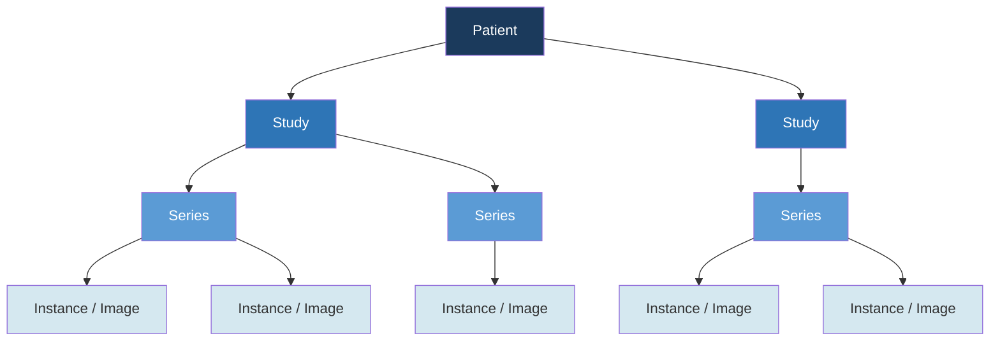
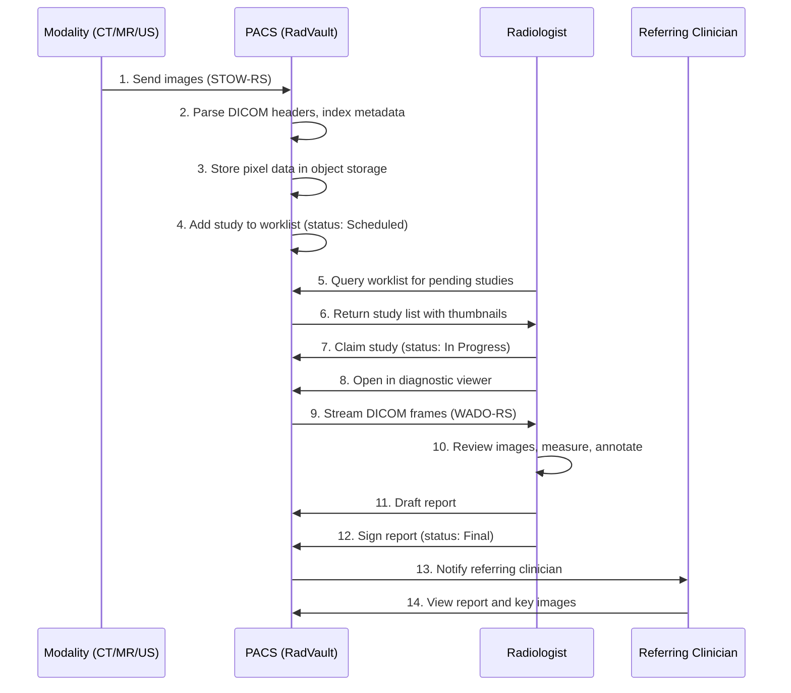
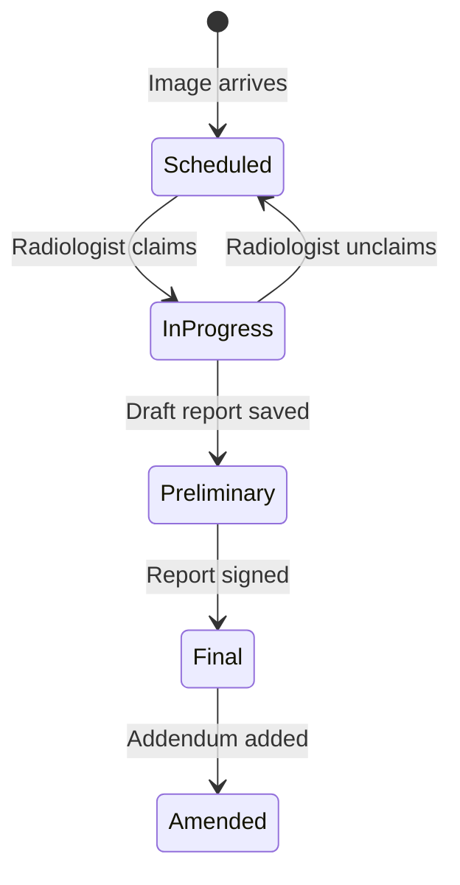

# Domain Primer: PACS & DICOM

This document gives you the clinical and technical context needed to build RadVault. You do not need prior radiology experience — this primer, combined with the resources in [05-RESOURCES.md](05-RESOURCES.md) and AI-assisted research, should be sufficient.

## What Is a PACS?

A **Picture Archiving and Communication System (PACS)** is the software infrastructure that every radiology department relies on daily. When a patient gets an X-ray, CT scan, MRI, or ultrasound, the resulting images flow into the PACS, where radiologists retrieve, view, and interpret them, then produce diagnostic reports that go back to the ordering physician.

Think of PACS as the "operating system" for medical imaging: it connects the imaging equipment (modalities) to the radiologists who read the images and the clinicians who act on the results.

## The DICOM Standard

**DICOM (Digital Imaging and Communications in Medicine)** is the universal standard for medical imaging. Every medical image — from a dental X-ray to a cardiac MRI — is stored and transmitted as a DICOM object. DICOM defines both the file format and the network protocols for exchanging images.

### The DICOM Hierarchy

DICOM organizes imaging data in a strict four-level hierarchy:



| Level | What It Represents | Unique Identifier | Example |
|---|---|---|---|
| **Patient** | A person receiving care | Patient ID | `PAT-00123` |
| **Study** | One imaging session/order | Study Instance UID | A chest CT ordered on 2024-03-15 |
| **Series** | One acquisition within a study | Series Instance UID | Axial slices with contrast |
| **Instance** | One DICOM object (usually one image) | SOP Instance UID | Slice #47 of the axial series |

**Key insight:** A single CT scan can produce 500+ instances (one per slice), organized into multiple series (e.g., with/without contrast, different reconstruction kernels), all under one study.

### DICOM Tags (Metadata)

Every DICOM file contains a header with hundreds of metadata tags. The most important ones for a PACS:

| Tag | Name | Example |
|---|---|---|
| `(0010,0010)` | Patient Name | `DOE^JOHN` |
| `(0010,0020)` | Patient ID | `PAT-00123` |
| `(0008,0020)` | Study Date | `20240315` |
| `(0008,0060)` | Modality | `CT`, `MR`, `US`, `CR`, `DX` |
| `(0008,1030)` | Study Description | `CT CHEST W CONTRAST` |
| `(0008,0050)` | Accession Number | `ACC-98765` |
| `(0008,0090)` | Referring Physician | `DR SMITH` |
| `(0020,000D)` | Study Instance UID | `1.2.840.113619...` |
| `(0020,000E)` | Series Instance UID | `1.2.840.113619...` |
| `(0008,0018)` | SOP Instance UID | `1.2.840.113619...` |
| `(0028,0010)` | Rows | `512` |
| `(0028,0011)` | Columns | `512` |
| `(7FE0,0010)` | Pixel Data | *(binary image data)* |

### Modalities

| Code | Modality | Common Use |
|---|---|---|
| CT | Computed Tomography | Cross-sectional body imaging |
| MR | Magnetic Resonance | Soft tissue, brain, spine |
| US | Ultrasound | Real-time, obstetrics, cardiac |
| CR | Computed Radiography | Traditional X-rays (digital) |
| DX | Digital Radiography | Direct digital X-rays |
| MG | Mammography | Breast imaging |
| NM | Nuclear Medicine | Functional imaging |
| PT | PET (Positron Emission Tomography) | Cancer staging, cardiac |

## DICOMweb: The RESTful API

**DICOMweb** is the modern, REST-based standard for DICOM operations. It replaces the older binary DIMSE network protocol with familiar HTTP/JSON patterns.

### Three Core Services

| Service | Purpose | HTTP Method | Analogy |
|---|---|---|---|
| **STOW-RS** | Store DICOM objects | `POST` | Upload images to the PACS |
| **QIDO-RS** | Query for DICOM objects | `GET` | Search for studies/series/instances |
| **WADO-RS** | Retrieve DICOM objects | `GET` | Download images or rendered frames |

**STOW-RS** (Store Over the Web):
```
POST /studies
Content-Type: multipart/related; type="application/dicom"

--boundary
Content-Type: application/dicom
<DICOM file bytes>
--boundary--
```

**QIDO-RS** (Query based on ID for DICOM Objects):
```
GET /studies?PatientName=DOE*&StudyDate=20240301-20240315&ModalitiesInStudy=CT
Accept: application/dicom+json
```

**WADO-RS** (Web Access to DICOM Objects):
```
# Retrieve DICOM object
GET /studies/{studyUID}/series/{seriesUID}/instances/{instanceUID}

# Retrieve rendered frame (as JPEG/PNG for web viewing)
GET /studies/{studyUID}/series/{seriesUID}/instances/{instanceUID}/rendered
```

## Clinical Workflow

This is the end-to-end flow your PACS must support:



### Worklist Status Machine



### Reporting

Radiology reports follow a structured format:

- **Header:** Patient demographics, study info, ordering physician, indication
- **Technique:** How the imaging was performed (contrast, sequences, etc.)
- **Comparison:** Prior studies available for comparison
- **Findings:** Detailed observations organized by anatomy
- **Impression:** Summary of key findings and recommendations

## Viewer Concepts

### Window/Level (Windowing)

Medical images store pixel values in Hounsfield Units (CT) or signal intensity (MRI) with a much wider range than a monitor can display. **Windowing** maps a subset of these values to the visible grayscale range.

| Preset | Window Width | Window Level | Shows Best |
|---|---|---|---|
| Lung | 1500 | -600 | Air-filled structures, lung parenchyma |
| Bone | 2000 | 400 | Skeletal structures, calcifications |
| Soft Tissue | 400 | 40 | Organs, muscles |
| Brain | 80 | 40 | Intracranial structures |
| Liver | 150 | 60 | Hepatic lesions |

### Hanging Protocols

Radiologists expect images to appear in specific layouts depending on the study type. A **hanging protocol** automatically arranges series in the viewer:

- CT Chest: Axial soft tissue (main), axial lung window (side), coronal reformat (bottom)
- MR Brain: T1 axial, T2 axial, FLAIR, DWI — arranged in a 2x2 grid
- Prior comparison: Current study left, prior study right

### Measurement Tools

Basic diagnostic tools every viewer needs:

- **Length**: Measure distance between two points (in mm)
- **Angle**: Measure angle between three points (in degrees)
- **ROI (Region of Interest)**: Draw an ellipse/rectangle, get mean/std dev of pixel values within
- **Pan/Zoom**: Navigate within an image
- **Scroll**: Navigate through slices in a series

## HIPAA Considerations

Since this system handles Protected Health Information (PHI), your design should consider:

- **Access Control**: Role-based permissions. Not everyone sees everything.
- **Audit Logging**: Every access to PHI must be logged (who, what, when).
- **Encryption**: Data at rest (AES-256) and in transit (TLS 1.2+).
- **Minimum Necessary**: Users should only see what they need for their role.
- **De-identification**: Support for stripping PHI from DICOM headers (for research/demo).

> **Note:** This is a coding assessment, not a HIPAA compliance certification. We're looking for awareness and reasonable design choices, not a complete compliance implementation.

## Next Steps

Now that you understand the domain:
1. Read the [Technical Requirements](03-TECHNICAL-REQUIREMENTS.md) for implementation details
2. Browse the [Resources](05-RESOURCES.md) for libraries, tools, and test data
3. Start your [Requirements Document](../templates/REQUIREMENTS.md)
