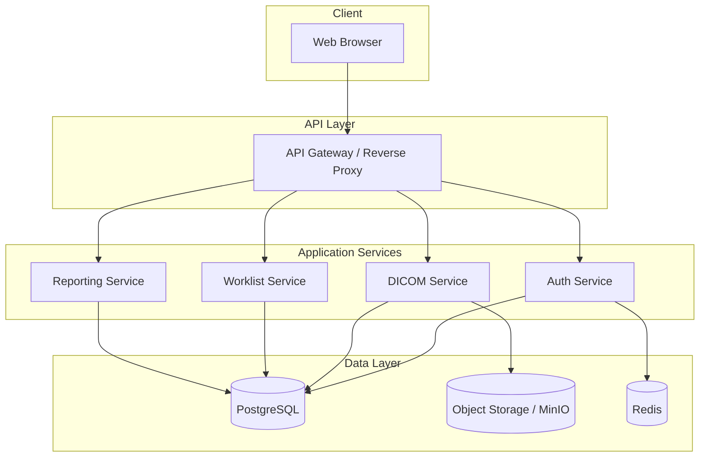
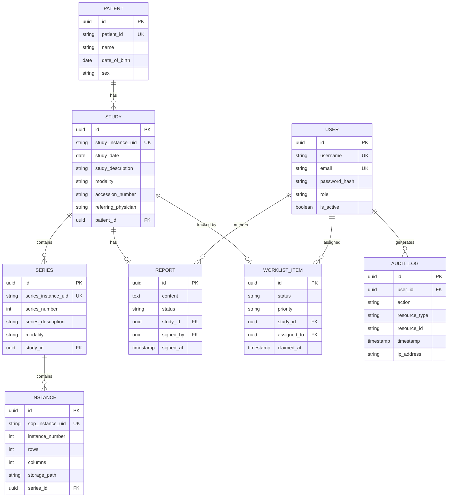
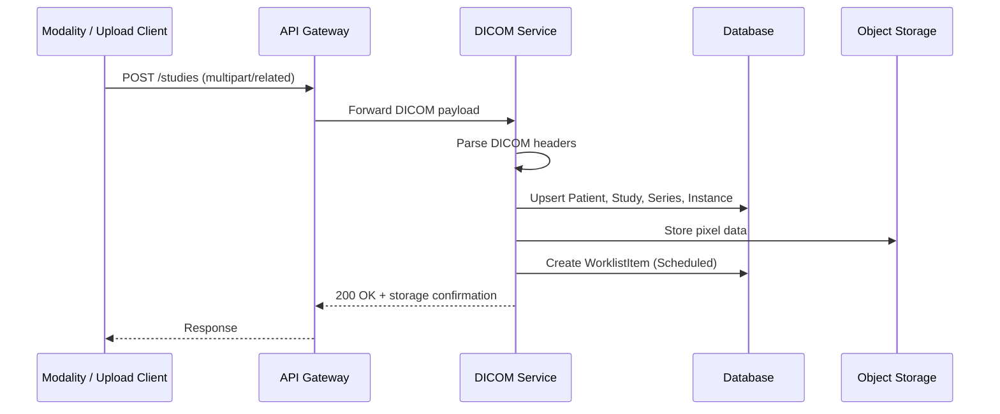
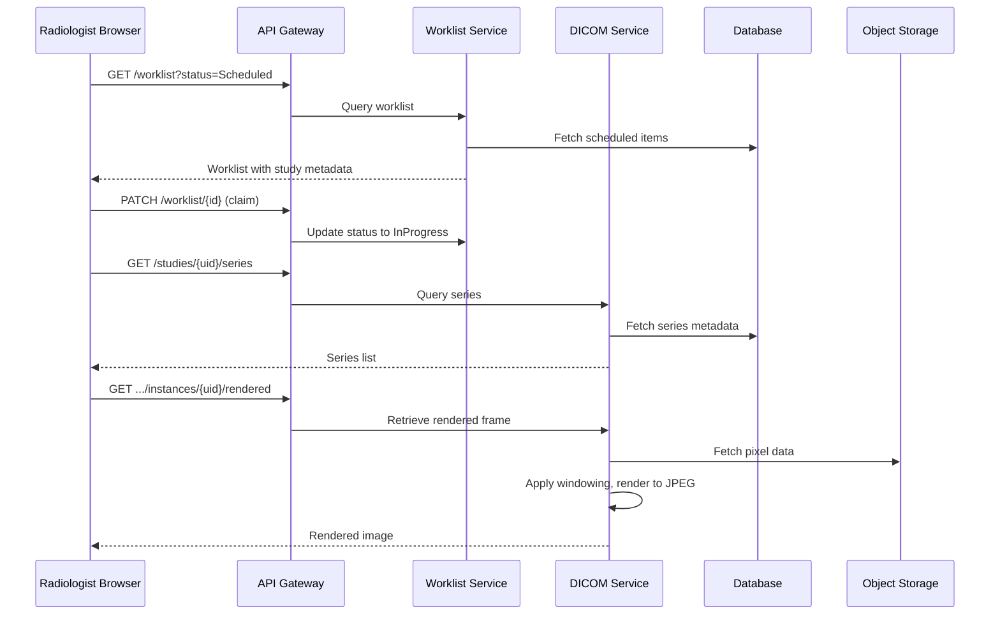
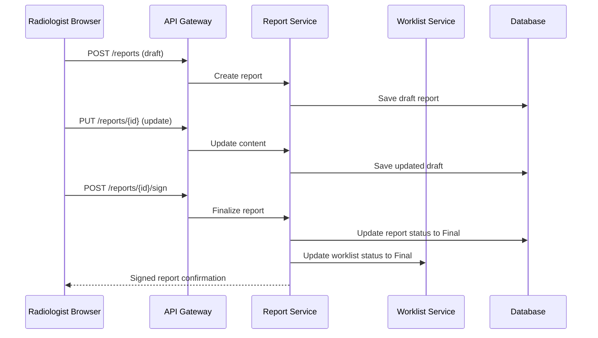
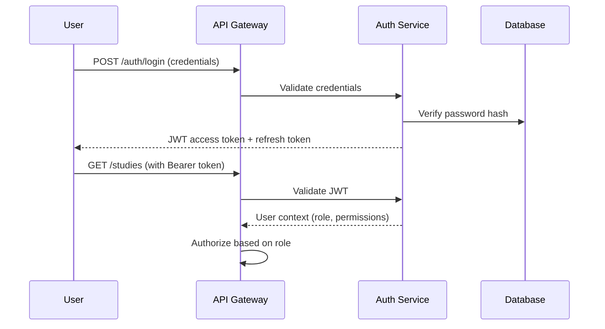
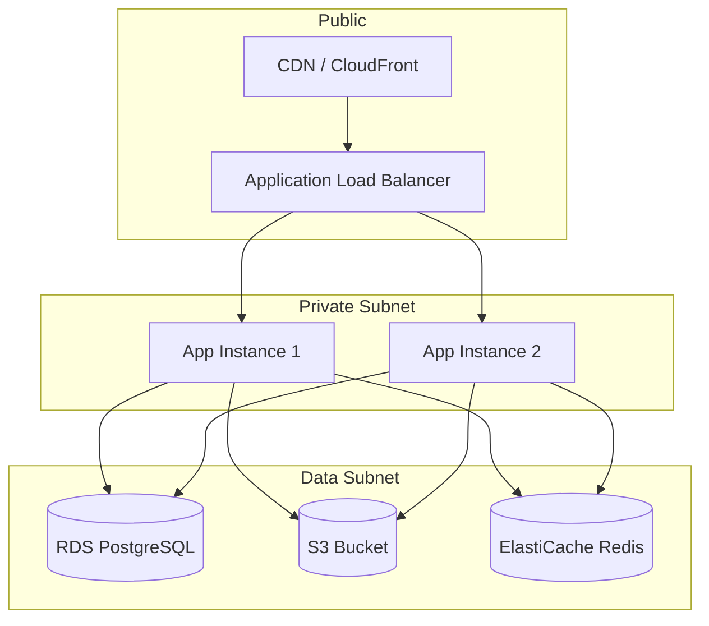
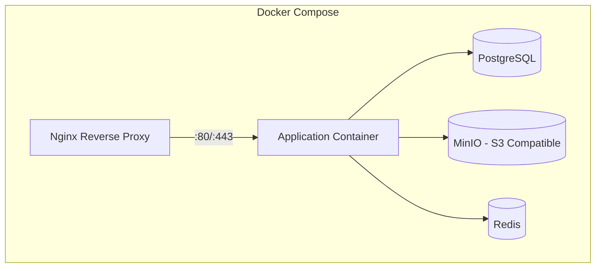

# RadVault — Architecture Document

> Companion to [REQUIREMENTS.md](REQUIREMENTS.md). This document captures your system design with diagrams and detailed explanations.

**Author:** <!-- Your name -->
**Date:** <!-- Date -->

---

## System Overview

### High-Level Architecture

### Description

<!-- Explain your architecture decisions:
     - Why this service structure? (monolith, modular monolith, microservices)
     - How do services communicate?
     - What are the key data flows?
     - Where are the scaling bottlenecks?
-->

---

## Data Model

### Entity-Relationship Diagram

<!-- MODIFY the diagram above to match your actual data model.
     Add fields, relationships, and entities as needed. -->

### Design Decisions

<!-- Explain:
     - Why these field types?
     - How do DICOM UIDs map to your IDs?
     - How do you handle DICOM metadata beyond the core fields?
     - Indexing strategy for query performance
-->

---

## Request Flow Diagrams

### DICOM Ingestion Flow

### Study Viewing Flow

### Reporting Flow

---

## Security Architecture

### Authentication Flow

### Authorization Matrix

<!-- Fill in your actual permission model -->

---

## Infrastructure

### Cloud Deployment Architecture

### Container Architecture

---

## Appendix

### Technology Comparison Notes

<!-- If you evaluated multiple options, document your comparison here -->

### Open Questions

<!-- List any unresolved questions for discussion with the evaluation team -->
