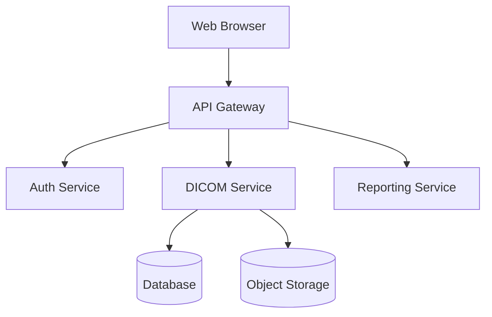
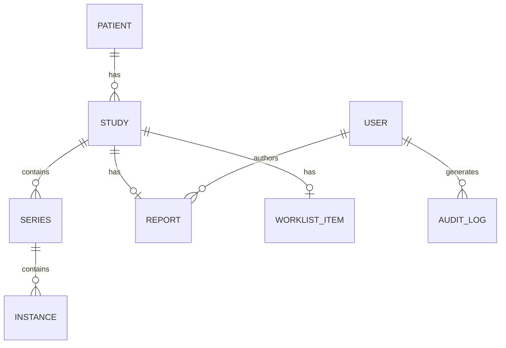
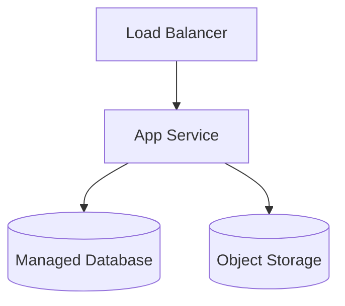

# RadVault — Requirements & Design Document

> **Phase 1 Deliverable.** Fill out each section below. Push to your repo and notify the evaluation team when ready for review.

**Author:** <!-- Your name -->
**Date:** <!-- Date -->
**Version:** <!-- 1.0, 1.1 after feedback, etc. -->

---

## 1. Technology Stack Selection

Justify your choices. Explain trade-offs you considered.

### Language(s) & Runtime

<!-- YOUR CONTENT HERE -->

### Backend Framework

<!-- YOUR CONTENT HERE -->

### Frontend Framework

<!-- YOUR CONTENT HERE -->

### Database(s)

<!-- YOUR CONTENT HERE -->

### Object Storage

<!-- YOUR CONTENT HERE -->

### Key Libraries

<!-- List DICOM parsing, viewer, and other critical libraries. Explain why. -->

---

## 2. System Architecture

### Architecture Diagram

### Architecture Description

<!-- Describe your architecture. Why this structure? What are the service boundaries?
     How do services communicate? What patterns are you using (monolith, microservices, modular monolith)?
     What trade-offs did you make? -->

---

## 3. Data Model

### ER Diagram

### Entity Descriptions

<!-- For each entity: describe key fields, constraints, and relationships.
     Pay attention to how DICOM UIDs map to your schema. -->

---

## 4. API Contract

### DICOMweb Endpoints

<!-- Define STOW-RS, QIDO-RS, and WADO-RS endpoints.
     For each: method, path, request/response format, key parameters.
     You may include a separate OpenAPI YAML or define it inline. -->

### Custom API Endpoints

<!-- Define your worklist, reporting, auth, and admin endpoints.
     For each: method, path, request body, response body, auth requirements. -->

---

## 5. DICOM Handling Strategy

### Ingestion Pipeline

<!-- How do DICOM files flow from upload to storage?
     How do you parse headers? Where do you store pixel data vs. metadata?
     How do you handle validation? Thumbnail generation? -->

### Storage Architecture

<!-- How is pixel data stored? How do you handle large files?
     What's your approach to metadata indexing?
     How does retrieval work (WADO-RS)? -->

### Rendering

<!-- How are DICOM frames rendered for the web viewer?
     Do you pre-render or render on demand?
     How do you handle windowing/leveling? -->

---

## 6. Security Design

### Authentication Flow

<!-- Describe the login flow, token lifecycle, refresh mechanism. -->

### Authorization Matrix

| Role | Upload | Search | View Images | Create Report | Sign Report | Admin |
|---|---|---|---|---|---|---|
| Admin | | | | | | |
| Radiologist | | | | | | |
| Technologist | | | | | | |
| Referring Physician | | | | | | |

<!-- Fill in the matrix above with ✅ / ❌ -->

### PHI Protection

<!-- How do you handle audit logging, encryption at rest, encryption in transit?
     What HIPAA-relevant controls are you implementing? -->

---

## 7. Infrastructure Blueprint

### Cloud Architecture Diagram

### IaC Module Breakdown

<!-- What Terraform/Pulumi modules will you create?
     What cloud services are you targeting?
     How do you handle environments (dev/staging/prod)? -->

---

## 8. Testing Strategy

### Test Pyramid

| Layer | What You're Testing | Tools | Target Coverage |
|---|---|---|---|
| Unit | | | |
| Integration | | | |
| E2E | | | |

### DICOM Test Data

<!-- How will you obtain test DICOM data?
     How will you generate synthetic data for unit tests?
     What edge cases will you test? -->

---

## 9. Scope & Assumptions

### In Scope

<!-- List what you WILL build -->

### Out of Scope

<!-- List what you WON'T build and why -->

### Simplifying Assumptions

<!-- What assumptions are you making to fit the time constraint?
     E.g., "Single-tenant only", "No DICOM worklist SCP", etc. -->

---

## 10. Estimated Timeline

| Phase | Hours | Activities |
|---|---|---|
| Setup & Scaffolding | | |
| Backend Core (DICOM, Auth) | | |
| Frontend (Study Browser, Viewer) | | |
| Reporting & Worklist | | |
| Infrastructure (Docker, IaC, CI/CD) | | |
| Testing & Polish | | |
| Documentation & Retrospective | | |
| **Total** | | |
